# CycleGAN-Pytorch
Minimum Implementation of CycleGAN in PyTorch

(This project is for course CE7454 Deep Learning for Data Science @ NTU Singapore)

Target: to create wintery images for Singapore city view and Nanyang Technological University campus. 

Method: CycleGAN (https://arxiv.org/abs/1703.10593)

Original Implementation of CycleGAN by Jun-Yan Zhu can be found at https://github.com/junyanz/pytorch-CycleGAN-and-pix2pix.
Codes are well written but are complicated for beginners. 

Some examples:

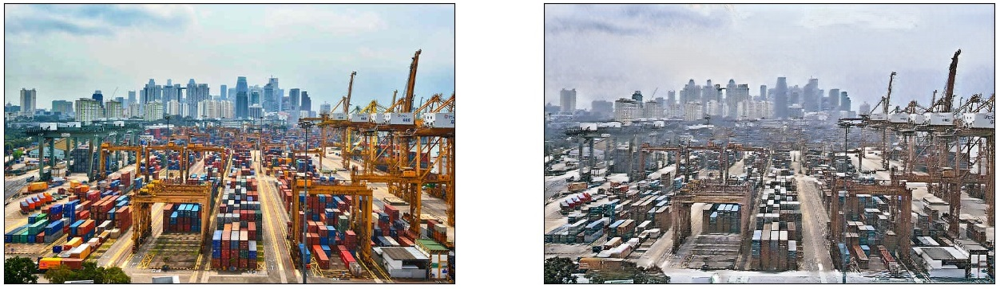
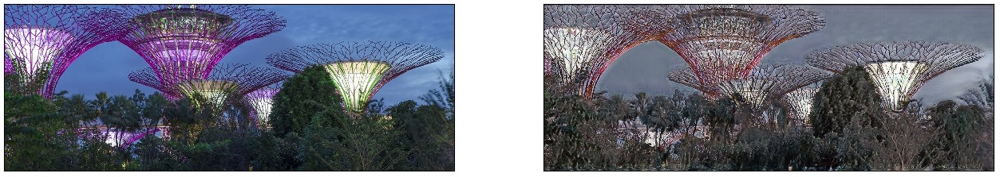
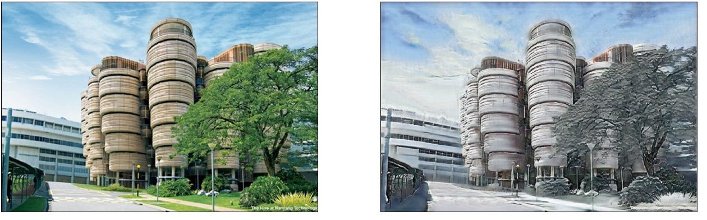
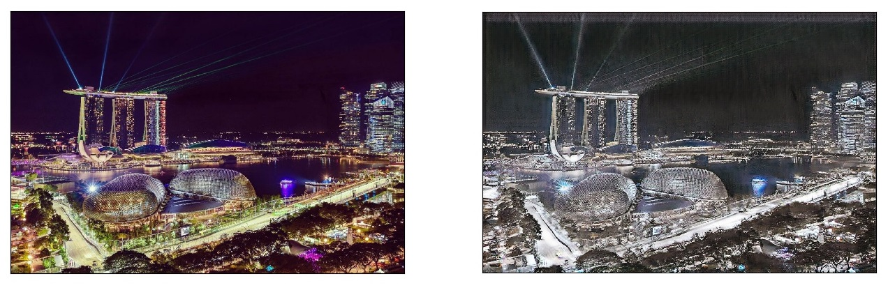
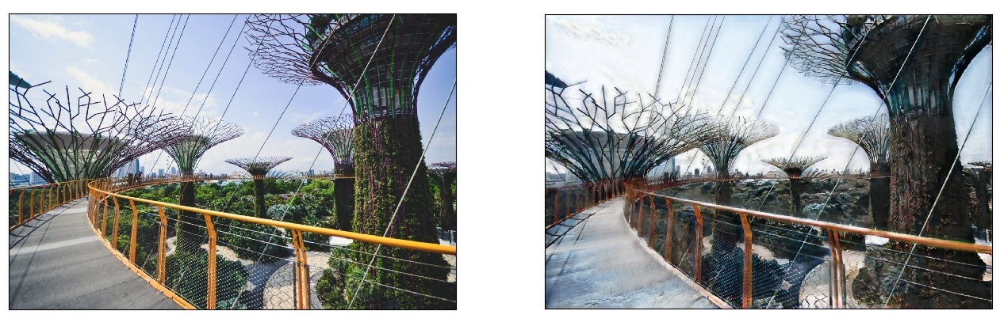

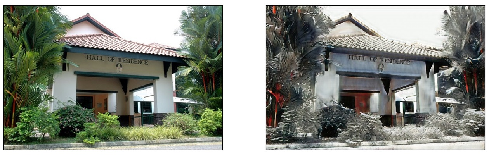
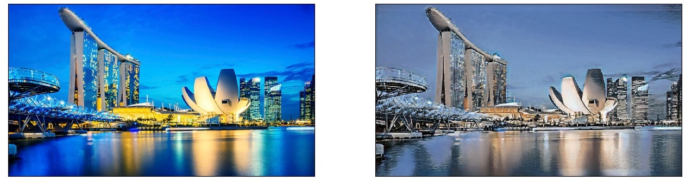
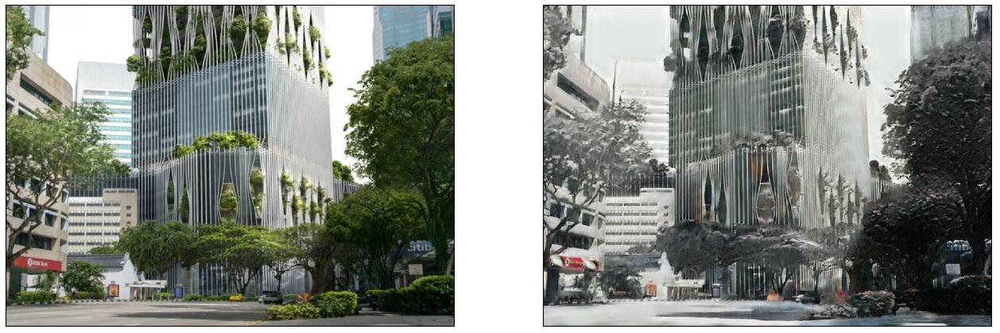
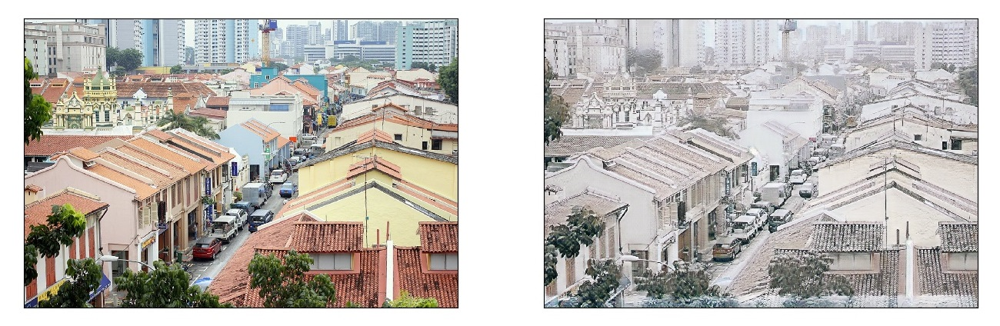
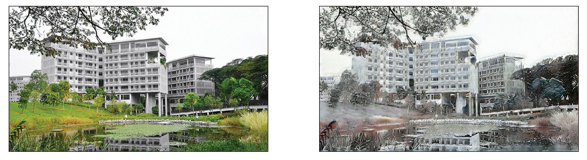
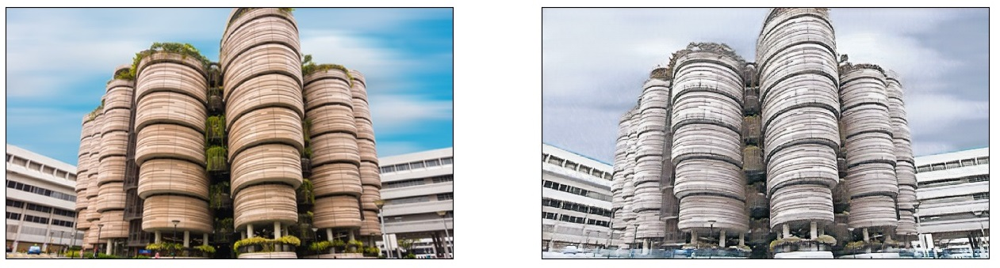
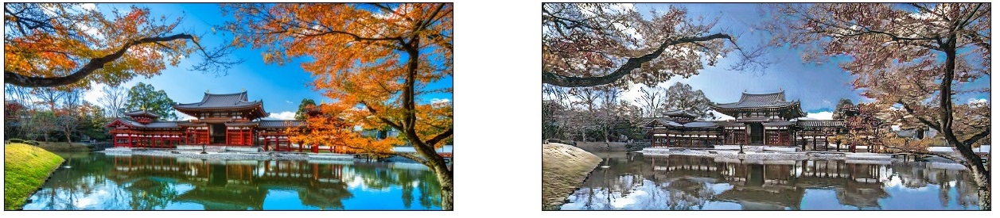

To train on your own dataset or modifify settings,
Simply change 'Training Configs' and 'Inference Configs' blocks in the .ipynb file!
