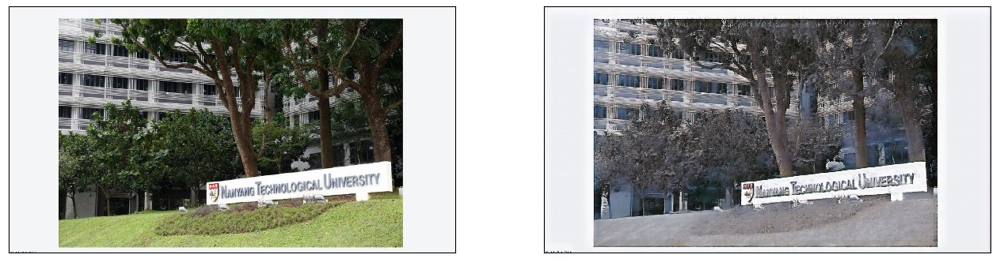

# CycleGAN-Pytorch
Minimum Implementation of CycleGAN in PyTorch

Method: CycleGAN (https://arxiv.org/abs/1703.10593)

This repo is an assignment for the course CE7454 Deep Learning for Data Science at NTU Singapore. It generates wintery scenes of Singapore and NTU campus via CycleGAN.

Original Implementation of CycleGAN by Jun-Yan Zhu can be found at https://github.com/junyanz/pytorch-CycleGAN-and-pix2pix.
Codes are well written but are complicated for beginners. This is a simplified version of CycleGAN.

Some examples:

To train on your own dataset or modifify settings,
Simply change 'Training Configs' and 'Inference Configs' blocks in the .ipynb file!
